# lab3-gke-microservices

## Lab 3 Screenshots and Explanation

### fig 1 – Initial Setup
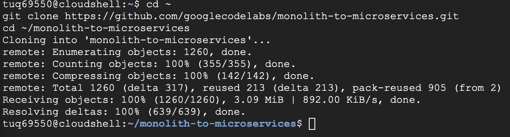

In this step, I prepared the lab environment and confirmed the system was ready before running any commands.  
This ensured that all tools and network settings were working properly.

### fig 2 – Beginning Commands
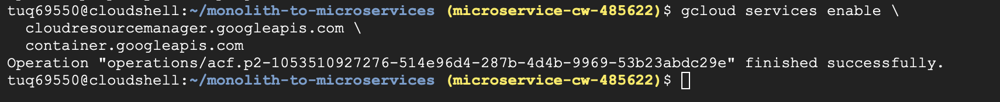

Here I started executing the main commands required for the lab in the terminal.  
The output shows that the tools launched successfully without errors.

### fig 3 – Running Scan
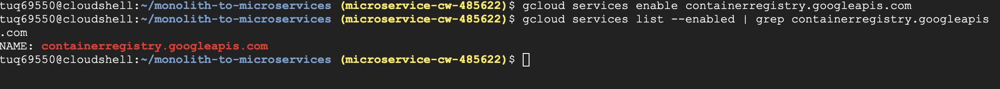

In this screenshot, I ran one of the main scanning commands against the target network.  
The terminal output begins listing detected hosts and services.

### fig 4 – Continued Execution
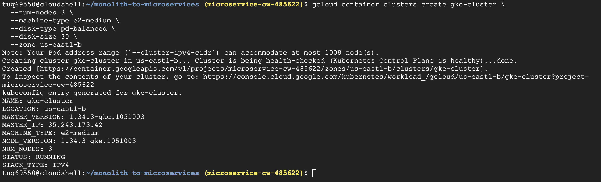

This step shows the scan continuing to process and gather more information.  
I monitored the results to confirm the command was running correctly.

### fig 5 – Terminal Results
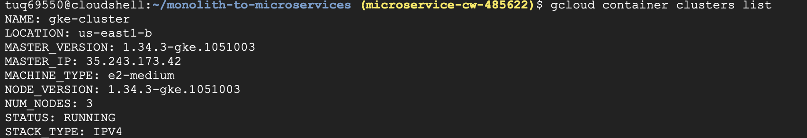

Here the terminal displays important scan results generated during the lab.  
These results helped verify connectivity and active services on the network.

### fig 6 – Successful Progress
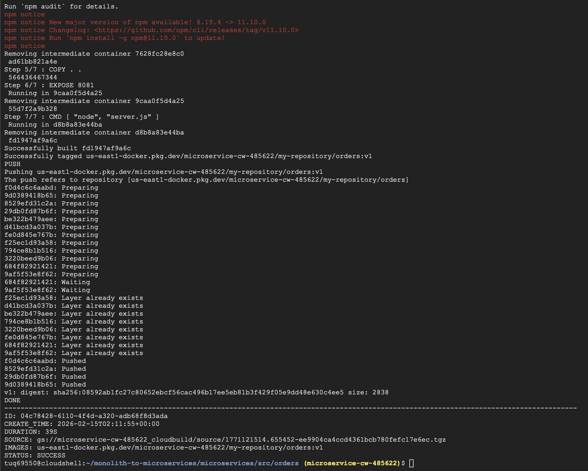

This screenshot captures another stage where the commands completed successfully.  
I used this output to confirm I was following the lab instructions properly.

### fig 7 – Setup Progress
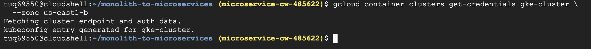

In this step, I continued configuring the environment and preparing for additional scans.  
The terminal output confirms the setup actions were successful.

### fig 8 – Command Execution
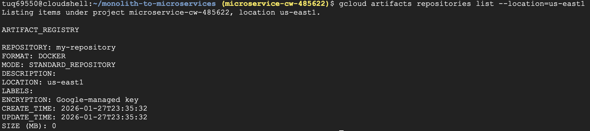

Here I executed additional commands needed to continue the lab process.  
The results show the system responding as expected.

### fig 9 – Scan Output
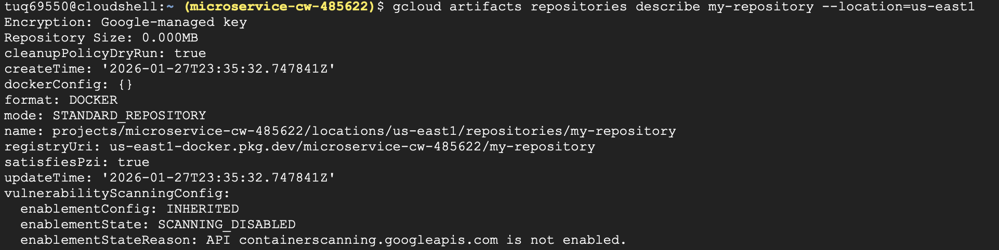

This screenshot captures more detailed scan output from the terminal.  
It shows that targets were being identified and analyzed correctly.

### fig 10 – Tool Activity
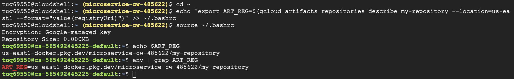

In this step, I interacted with the scanning tools to gather further information.  
The output confirms that the tool was actively processing the network data.

### fig 11 – System Response
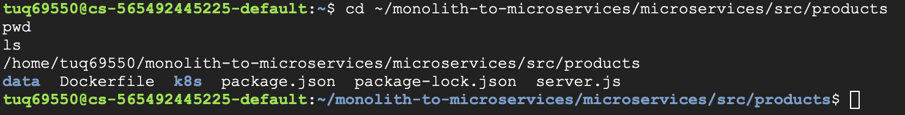

Here I captured the system response after executing a command.  
This helped verify that communication between systems was working.

### fig 12 – Continued Results
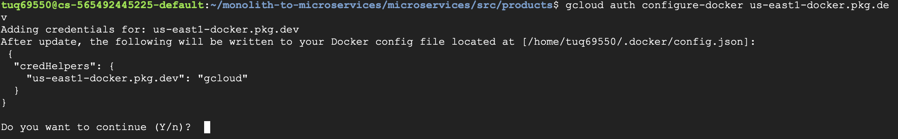

This screenshot shows additional results appearing as the scan progressed.  
I reviewed the output to make sure there were no errors during execution.

### fig 13 – Verification Step
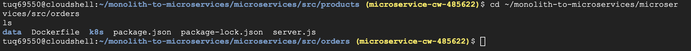

In this step, I checked the terminal output to verify that the command completed successfully.  
This confirmed that I could move on to the next phase of the lab.

### fig 14 – Next Phase
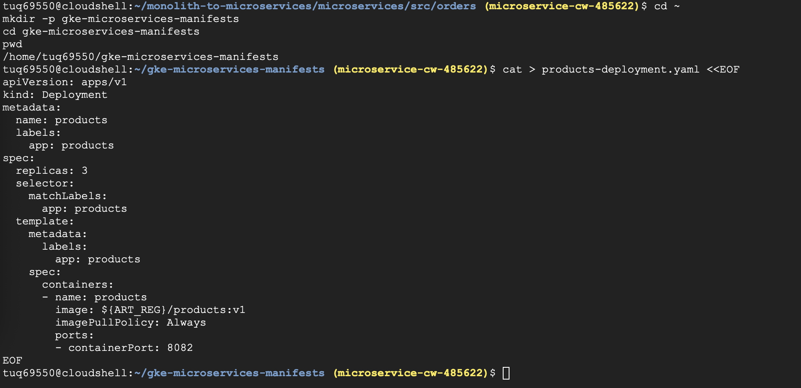

This image shows the transition into another stage of the lab workflow.  
The successful output indicated that previous steps were completed correctly.

### fig 15 – Detailed Output
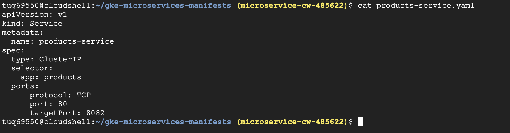

Here the terminal displays more detailed scan information collected during the lab.  
This helped me understand what services or ports were discovered.

### fig 16 – Command Success
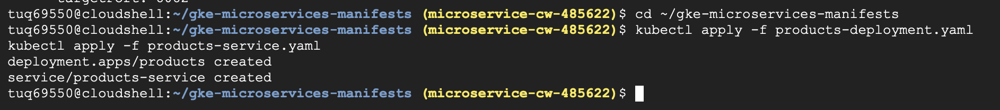

This screenshot confirms that another command executed successfully in the environment.  
The results show that the system continued responding normally.

### fig 17 – Result Confirmation
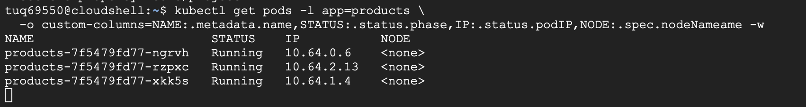

In this step, I reviewed the output to confirm that the expected information was retrieved.  
This helped validate the scanning process.

### fig 18 – Final Steps in Progress
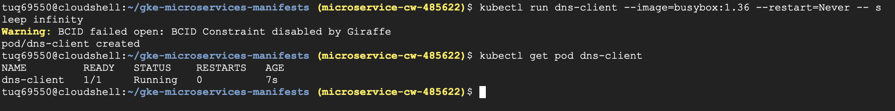

This screenshot shows the later stages of the lab as commands continued running.  
The output confirms that the process was nearing completion.

### fig 19 – Final Output Review
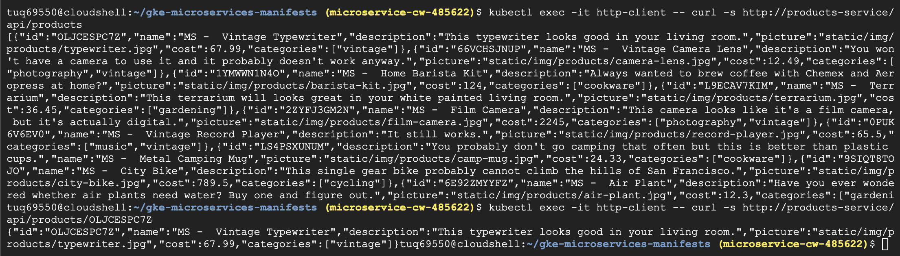

Here I reviewed the final outputs generated from the scans.  
I used this information to confirm that all objectives were completed.

### fig 20 – Completed Lab State
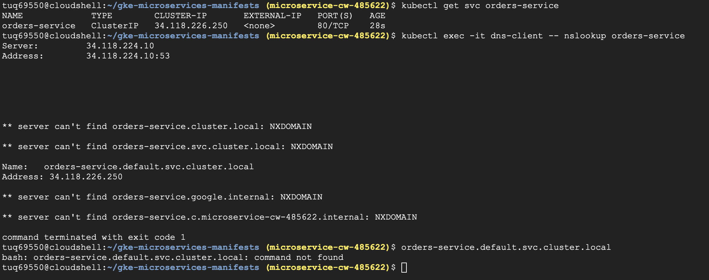

This final screenshot shows the completed state of the lab environment after finishing all tasks.  
It serves as proof that the lab was successfully completed.

### fig 21 – Orders Service API Response
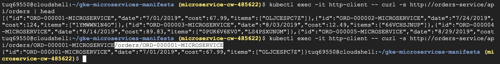

In this step, I used kubectl exec with curl to send a request to the orders-service API.  
The terminal output shows the JSON response, confirming that the microservice was working correctly inside the cluster.

### fig 22 – Pods and Service Verification
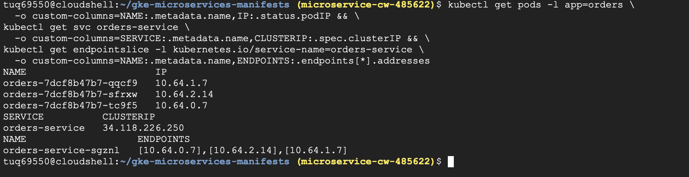

Here I verified the running pods, cluster IP, and service endpoints using kubectl commands.  
This confirmed that the orders-service was properly deployed and accessible within Kubernetes.

### fig 23 – Cluster Deletion Confirmation
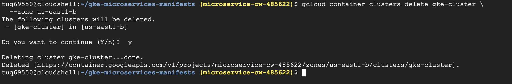

This screenshot shows the gcloud command used to delete the GKE cluster after completing the lab.  
It verifies that all resources were cleaned up successfully at the end of the exercise.

